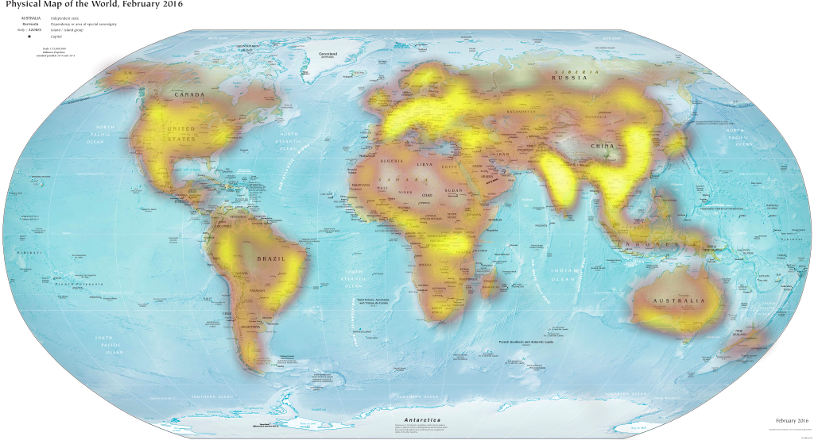

# Heatimage

**A library for overlaying heat on static images.**

Draw heat over static images or simply visualize existing datasets.


[](https://github.com/prettier/prettier)

## [Demo](https://mmaltsev.github.io/Heatimage/examples/demo)

## Installation

The easiest way to get started is to install it via npm and improt it into your project:

```
npm install heatimage
```

```js
import * as Heatimage from 'heatimage'
```

Or to add a direct link to the library into your html file:

```html
<script src="https://unpkg.com/heatimage@latest/dist/bundle.js"></script>
```

## Usage
Create an `img` element and give it an id, e.g.:

```html

```

Then, use specified id in order to select an `img` element, specify options and trigger Heatimage library in your js / ts file or `<script> </script>` tags in html file:

```js
let element = document.querySelector('#heatimage')

let heatOptions = {
  heatValue: 0.05,
  heatRadius: 15,
  heatBlur: 25,
  colorGradient: 'Visible Spectrum',
  exporting: true,
  edit: true,
  keys: true,
  defaultData: [
    {x: 375, y: 84, value: 0.05},
    {x: 377, y: 84, value: 0.05},
    {x: 379, y: 88, value: 0.05}
  ],
}

Heatimage.heatimage(element, heatOptions)
```

## Options

#### heatOptions: { ... }

| Name | Values Ranges | Description |
| ---- | ------------- | ----------- |
| heatValue | number ⩾ 0 | value of heat point |
| heatRadius | number ⩾ 0 | radius of heat point |
| heatBlur | number ⩾ 0 | blur level of heat |
| colorGradient | [name of the palette](https://mmaltsev.github.io/Heatimage/examples/demo/gradients.html) | coloring scheme of heat |
| exporting | true / false | exporting menu at the top-right corner |
| edit | true / false | enable / disable drawing |
| keys | true / false | enable / disable using keyboard for drawing |
| defaultData | array of `{x, y, value}` objects | set default heat data |

## Results


[source image](https://upload.wikimedia.org/wikipedia/commons/thumb/5/59/Map_of_the_world_by_the_US_Gov_as_of_2016.svg/1024px-Map_of_the_world_by_the_US_Gov_as_of_2016.svg.png)

## Contributing
Build the library with `npm run build`. For a production version with console warnings, execute `npm run build:prod_warn`. This will fetch all dependencies and then compile the `dist` files. To see the examples locally you can start a web server with `npm run dev` and go to `localhost:8080` (`localhost:8081` if port `8080` is busy).

## License
MIT License. Copyright (c) 2017-2019 Maxim Maltsev.

## Authors
[Maxim Maltsev](https://github.com/mmaltsev).
